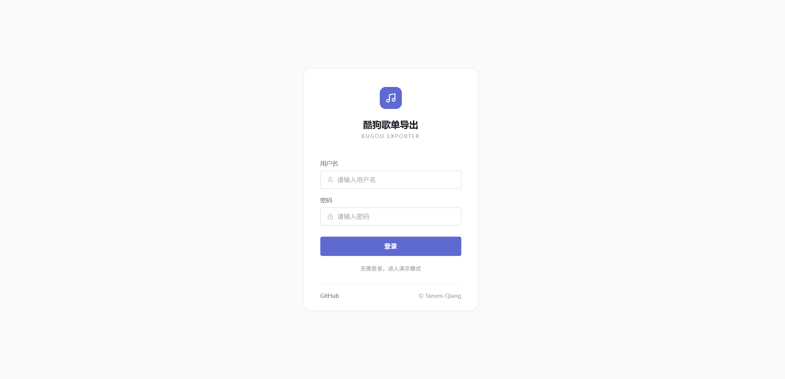
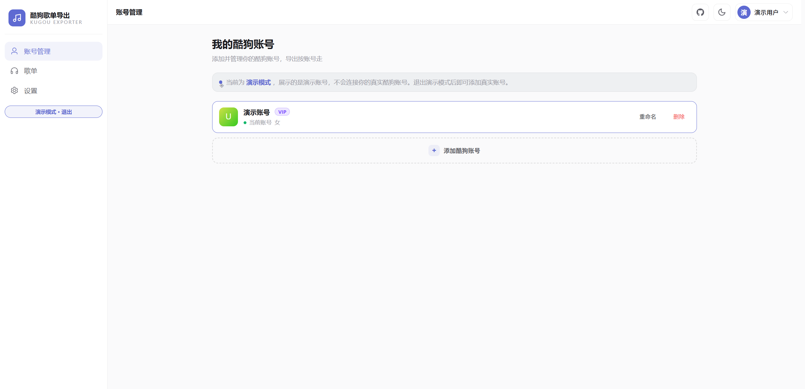
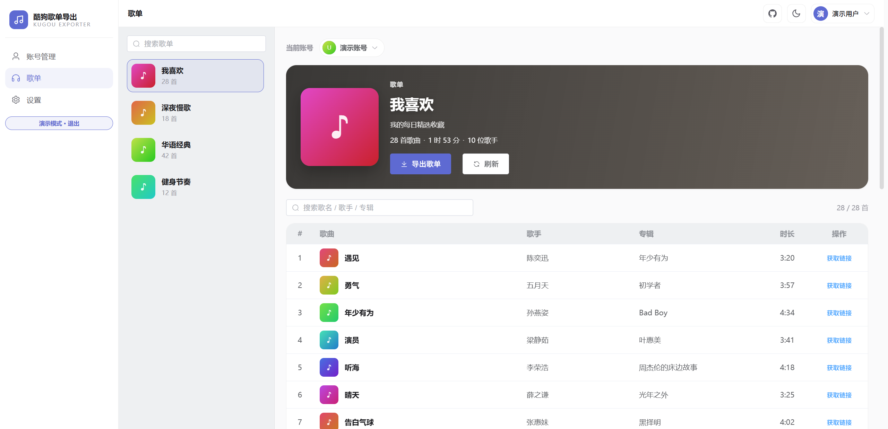
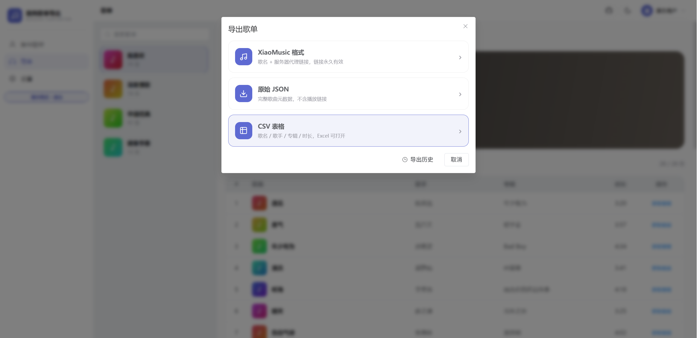
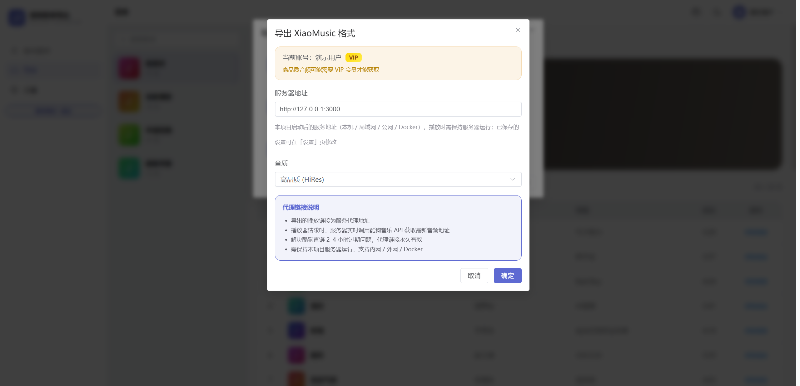

# 酷狗歌单一键导出

[](https://github.com/Steven-Qiang/kugou-exporter/stargazers)
[](https://github.com/Steven-Qiang/kugou-exporter/blob/main/LICENSE)
[](https://github.com/Steven-Qiang/kugou-exporter/issues)

kugou-exporter

一键导出酷狗歌单，轻松同步到小爱音箱等播放器

[功能特性](#功能特性) • [快速开始](#快速开始) • [使用说明](#使用说明) • [开发指南](#开发指南)

---

## 功能特性

- ⚡ 一键导出酷狗歌单，导入 XiaoMusic / 小爱音箱等播放器
- 📱 手机验证码登录 & 二维码扫码登录
- 📦 多格式导出：XiaoMusic / JSON / CSV（UTF-8 BOM，Excel 可读）
- 🔗 单曲链接获取（支持多音质，主链接 + 备用链接）
- 🔄 内建代理服务，实时获取最新播放链接，长期有效
- 👥 多用户系统：本地账户登录 / 会话，管理员可管理子用户
- 🎤 多酷狗账号：每用户可绑定多个账号并切换激活账号
- 👤 账号资料：显示酷狗头像、会员（VIP）、性别等
- 🧾 服务端持久化导出历史，按用户隔离

### 导出格式

#### XiaoMusic 格式

```json
[
  {
    "name": "歌单名称",
    "musics": [
      {
        "name": "歌名",
        "url": "http://your-server:3000/proxy/song/url?hash=xxx&quality=high"
      }
    ]
  }
]
```

**代理链接说明：**

- 导出的 URL 为服务代理地址
- 播放器请求时，服务器实时调用酷狗 API 获取最新音频地址
- 解决直接链接 2-4 小时过期问题，代理链接长期有效
- 需要保持服务器运行，支持内网 / 外网 / Docker 部署

#### 原始 JSON 格式

完整的歌曲元数据，包含专辑、歌手、时长等信息，不包含播放链接。

#### CSV 格式

表格格式，包含歌名、歌手、专辑、时长，可用 Excel 打开。

---

## 快速开始

### Docker 部署（推荐）

```bash
# 本地构建 + 运行（自动挂载 ./data 持久化）
docker compose up -d --build
```

服务地址：http://localhost:3000

### 本地 Node 运行

```bash
# 1. 安装依赖（postinstall 自动打 kugoumusicapi 补丁）
pnpm install

# 2. 构建前后端
pnpm build

# 3. 启动
pnpm start
```

服务地址：http://127.0.0.1:3000

> 首次访问（数据库中没有任何用户时）会进入初始化页，创建应用自身的第一个管理员账户。

---

## 使用说明

### 1. 初始化 & 登录

首次使用先初始化应用自身的管理员账户（用户名 + 密码，与酷狗账号相互独立），之后用它登录。



### 2. 连接酷狗账号（账号管理）

进入「账号管理」，通过**手机验证码**或**扫码**连接你的酷狗账号。登录态由服务端托管，可添加多个账号并切换激活账号。



### 3. 选择歌单

登录成功后，在歌单列表中选择要导出的歌单。



### 4. 导出歌单

点击「导出歌单」按钮，选择导出格式：



- **XiaoMusic 格式**：配置服务器地址和音质，生成包含代理链接的 JSON 文件
- **原始 JSON**：直接导出歌曲元数据，不包含播放链接
- **CSV 格式**：导出为表格文件，可用 Excel 打开



### 5. 查看单曲链接

点击歌曲列表中的「获取链接」按钮，可查看：

- **服务器代理**：长期有效的代理链接
- **直接链接**：酷狗音乐直接链接（主链接 + 备用链接）
- **XiaoMusic 格式**：单曲 JSON 格式
- **原始 JSON**：完整的 API 响应数据

支持选择不同音质，并一键复制。

### 6. 导入到 xiaomusic

在 xiaomusic 设置页面，选择导出的 JSON 文件导入即可。


---

## 开发指南

> 仅适用于开发者。

### 环境要求

- Node.js >= 24（使用原生 `node:sqlite`，24.2 起不再标记实验）
- pnpm >= 10（`packageManager: pnpm@10.29.3`）

### 安装依赖

```bash
pnpm install
```

### 开发模式

```bash
pnpm dev
```

并行启动前端 Vite（5173）与后端 tsx watch（3000，热重载）。

### 常用命令

```bash
pnpm lint        # ESLint + 自动修复
pnpm test        # Vitest 后端单元测试
pnpm build       # web（vue-tsc + vite）+ launcher（tsdown）
pnpm prettier    # Prettier 格式化
```

### 项目结构

```
kugou-exporter/
├── apps/
│   ├── launcher/              # Node 启动器（TypeScript，tsdown → dist/index.cjs）
│   │   ├── src/
│   │   │   ├── index.ts       # 装配 kugoumusicapi + 自定义路由 + 静态资源
│   │   │   ├── auth.ts        # refreshLogin（1h 节流）、registerDev（dfid）
│   │   │   ├── db.ts          # node:sqlite 初始化 + 建表 + 迁移
│   │   │   ├── routes/        # auth / config / export / history / kugou / proxy
│   │   │   ├── store/         # users / sessions / kugou / settings / history
│   │   │   ├── lib/           # password / export-content / kugou-profile
│   │   │   └── types/         # kugoumusicapi.d.ts / express.d.ts
│   │   └── test/              # Vitest 单元测试
│   └── web/                   # Vue3 前端
│       ├── src/
│       │   ├── components/    # AppLayout / ExportDialog / SongUrlDialog / QualitySelect / ThemeToggle
│       │   ├── views/         # Setup / Login / Accounts / Playlist / Settings
│       │   ├── router/        # 路由 + 登录守卫
│       │   ├── stores/        # 当前用户 / needsSetup
│       │   ├── api/           # auth / kugou / config / export / history / user
│       │   ├── utils/         # request / mock（演示模式）/ export / format / theme / image
│       │   └── types/         # 酷狗 API 数据结构
│       └── vite.config.ts     # 开发代理 /api → localhost:3000
├── scripts/
│   └── patch-kugoumusicapi.js # postinstall 补丁，重写依赖的 main.js/server.js/interface.d.ts
├── .github/workflows/         # ci.yml（PR 校验）+ release.yml（发布）
├── Dockerfile                 # 多阶段构建（node:24-alpine）
├── docker-compose.yml
└── package.json
```

---

## 许可证

MIT License

---

## 致谢

- [kugoumusicapi](https://github.com/MakcRe/KuGouMusicApi) - KuGouMusicApi
- [xiaomusic](https://github.com/hanxi/xiaomusic) - XiaoMusic

---

**如果这个项目对你有帮助，请给个 ⭐️ Star 支持一下！**
