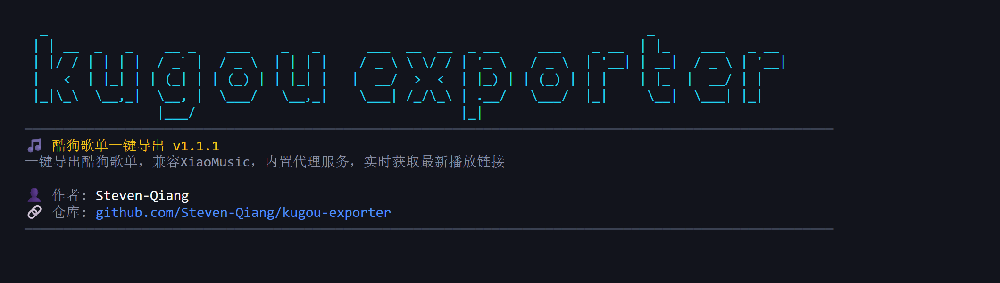

# 酷狗歌单一键导出

[](https://github.com/Steven-Qiang/kugou-exporter/stargazers)
[](https://github.com/Steven-Qiang/kugou-exporter/blob/main/LICENSE)
[](https://github.com/Steven-Qiang/kugou-exporter/issues)

kugou-exporter

一键导出酷狗歌单，轻松同步到小爱音箱等播放器

[功能特性](#功能特性) • [快速开始](#快速开始) • [使用说明](#使用说明) • [开发指南](#开发指南)

---

## 功能特性

- ⚡ 一键导出酷狗歌单，导入 XiaoMusic / 小爱音箱等播放器
- 📱 手机验证码登录 & 二维码扫码登录
- 📦 多格式导出：XiaoMusic / JSON / CSV
- 🔗 单曲链接获取（支持多音质）
- 🔄 内建代理服务，实时获取最新播放链接，永久有效
- 🎨 深浅色主题切换
- 📱 响应式界面，手机 / 平板 / 电脑
- 🧾 导出历史记录

### 导出格式

#### XiaoMusic 格式

```json
[
  {
    "name": "歌单名称",
    "musics": [
      {
        "name": "歌名",
        "url": "http://your-server:3000/proxy/song/url?hash=xxx&quality=high"
      }
    ]
  }
]
```

**代理链接说明：**

- 导出的 URL 为服务代理地址
- 播放器请求时，服务器实时调用酷狗 API 获取最新音频地址
- 解决直接链接 2-4 小时过期问题，代理链接永久有效
- 需要保持服务器运行，支持内网/外网/Docker 部署

#### 原始 JSON 格式

完整的歌曲元数据，包含专辑、歌手、时长等信息，不包含播放链接。

#### CSV 格式

表格格式，包含歌名、歌手、专辑、时长，可用 Excel 打开。

---

## 快速开始

### 下载安装

从 [Releases](https://github.com/Steven-Qiang/kugou-exporter/releases) 页面下载对应平台的可执行文件。

### 运行程序

双击运行下载的可执行文件即可。



服务地址：http://127.0.0.1:3000

### Docker 部署

#### 使用 Docker Hub 镜像（推荐）

```bash
# 拉取最新镜像
docker pull stevenxuq/kugou-exporter:latest

# 运行容器
docker run -d \
  -p 3000:3000 \
  -v ./kugou-exporter/data:/app/data \
  --name kugou-exporter \
  --restart unless-stopped \
  stevenxuq/kugou-exporter:latest
```

或使用 Docker Compose：

```yaml
version: '3.8'
services:
  kugou-exporter:
    image: stevenxuq/kugou-exporter:latest
    container_name: kugou-exporter
    ports:
      - '3000:3000'
    volumes:
      - ./data:/app/data
    restart: unless-stopped
```

#### 本地构建镜像

```bash
# 构建镜像
docker build -t kugou-exporter .

# 运行容器
docker run -d -p 3000:3000 -v ./data:/app/data --name kugou-exporter kugou-exporter
```

服务地址：http://localhost:3000

**注意：**

- 配置文件保存在 `./data/config.yaml`
- 导出时服务器地址填写：`http://你的主机IP:3000`

---

## 使用说明

### 1. 登录账号

选择以下任一方式登录：

- **手机验证码**: 输入手机号 → 获取验证码 → 登录
- **扫码登录**: 使用酷狗音乐 App 扫描二维码


### 2. 选择歌单

登录成功后，在歌单列表中选择要导出的歌单。


### 3. 导出歌单

点击「导出歌单」按钮，选择导出格式：


- **XiaoMusic 格式**：配置服务器地址和音质，生成包含代理链接的 JSON 文件
- **原始 JSON**：直接导出歌曲元数据，不包含播放链接
- **CSV 格式**：导出为表格文件，可用 Excel 打开


### 4. 查看单曲链接

点击歌曲列表中的「获取链接」按钮，可查看：

- **服务器代理**：永久有效的代理链接
- **直接链接**：酷狗音乐直接链接（主链接 + 备用链接）
- **XiaoMusic 格式**：单曲 JSON 格式
- **原始 JSON**：完整的 API 响应数据

支持选择不同音质，并一键复制。

### 5. 导入到 xiaomusic

在 xiaomusic 设置页面，选择导出的 JSON 文件导入即可。


---

## 开发指南

> 仅适用于开发者，普通用户请直接下载 [Release](https://github.com/Steven-Qiang/kugou-exporter/releases)

### 环境要求

- Node.js >= 18
- pnpm >= 8

### 安装依赖

```bash
pnpm install
```

### 开发模式

```bash
pnpm dev
```

### 构建项目

```bash
pnpm build
```

### 项目结构

```
kugoumusicapi-xiaomusic/
├── apps/
│   ├── launcher/              # Node.js 启动器
│   │   ├── index.js           # 启动服务
│   │   └── package.json
│   │
│   └── web/                   # Vue3 前端
│       ├── src/
│       │   ├── router/        # 路由配置
│       │   ├── types/         # TypeScript 类型
│       │   ├── utils/         # 工具函数
│       │   └── views/         # 页面组件
│       └── vite.config.ts
│
├── scripts/                   # 构建脚本
│   ├── build.js              # 打包脚本
│   └── patch-kugoumusicapi.js # API 补丁
│
└── pnpm-workspace.yaml        # Workspace 配置
```

### 构建说明

1. **前端构建**: Vite 打包 Vue 应用
2. **依赖打包**: ncc 将所有依赖打包成单文件
3. **二进制打包**: nexe 生成可执行文件

---

---

## 许可证

MIT License

---

## 致谢

- [kugoumusicapi](https://github.com/MakcRe/KuGouMusicApi) - KuGouMusicApi
- [xiaomusic](https://github.com/hanxi/xiaomusic) - XiaoMusic

---

**如果这个项目对你有帮助，请给个 ⭐️ Star 支持一下！**
